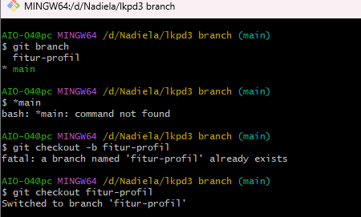
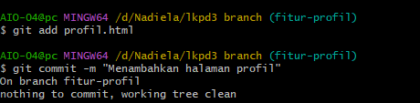
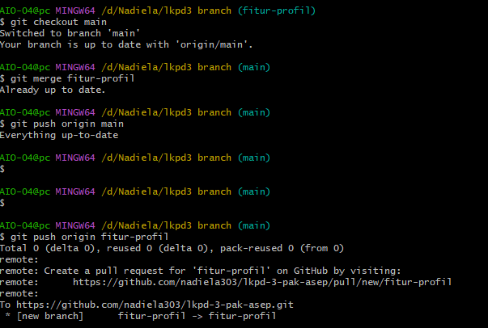

REFLEKSI LKPD 3 nadiela

1. Mengapa branch diperlukan?
Jawab: Supaya kita bisa nyoba-nyoba atau bikin fitur baru tanpa takut merusak kode utama yang udah jadi.

2. Apa keuntungan bekerja pada branch dibanding langsung di main?
Jawab: 
- Lebih aman, misal ada error nggak bakal ngacak-ngacak kode utama.
- Bikin pengerjaan proyek jadi lebih rapi dan teratur.

3. Kapan sebaiknya membuat branch baru?
Jawab: Setiap mau nambahin fitur baru, mau benerin error (bug), atau pas mau coba-coba eksperimen kode.

## Bukti Hasil

### 1. Screenshot Git Branch & Checkout

### 2. Screenshot Commit

### 3. Screenshot Merge & Push

